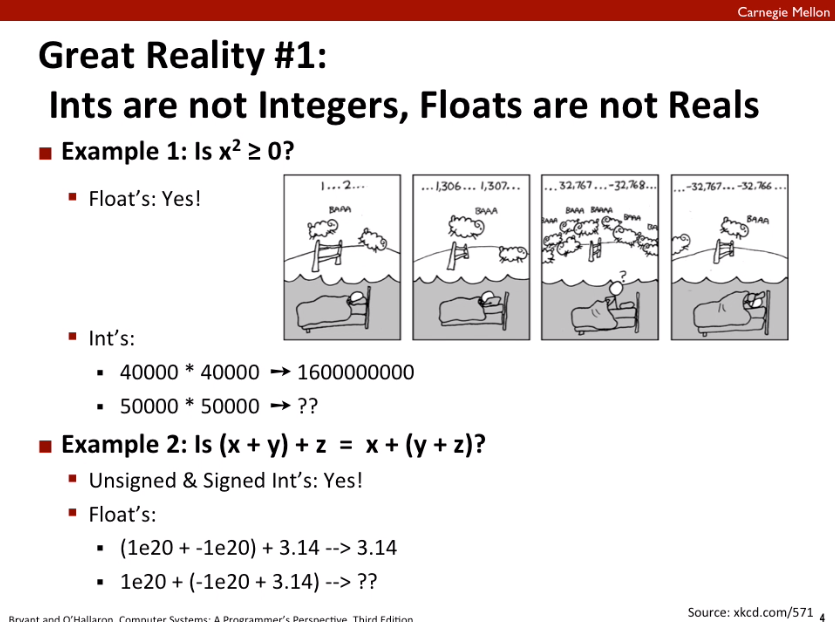
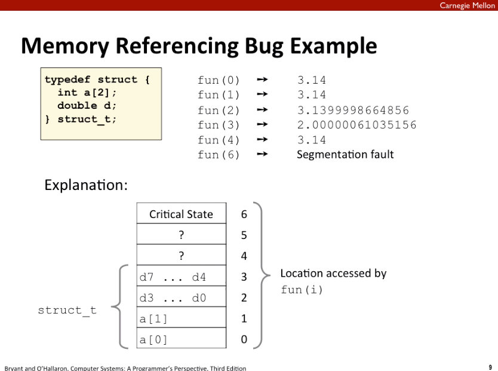
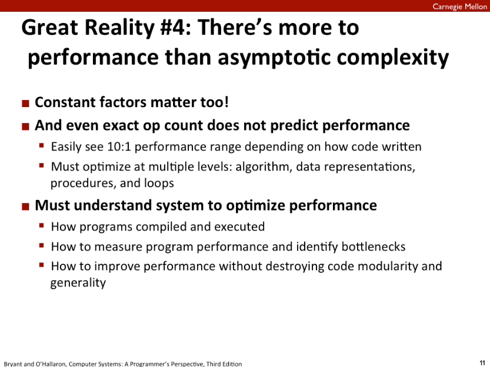

### Great Reality #1: Ints are not Integers, Floats are not Reals

* 注意区分逻辑数据类型与`machine level`的物理表示
* 数据的表示范围, Overflow
  * Int overflow会产生**确定**的错误结果
  * 浮点数超出可表示的数据范围会用`INF`表示

* C/C++ 没有内存访问越界检查, 所以应该谨慎访问内存, 避免产生未定义的结果或潜在的bug

* 性能优化不仅要关注渐近复杂度
* 了解程序编译运行, 内存管理等机制是程序性能优化的基础